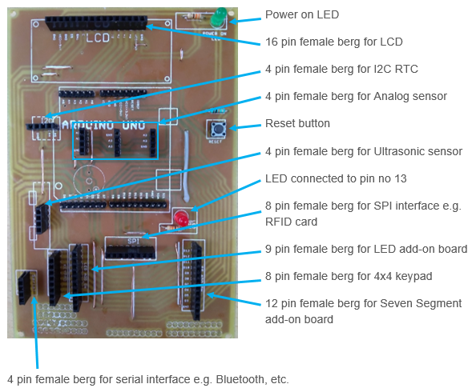

# Arduino Kit 
## This kit is based on Arduino Uno, for beginners, hobbyist
> Objective : 

The objective of this **Arduino Kit**, is to give basic understanding of microcontrollers, using world famous platform of Arduino IDE.

> About the Kit :  &nbsp;&nbsp;&nbsp;  [Topicwise Slides](./Slides)

 
IoT has revolutionised the digital world, by connecting all the things together. 

[Kit Layout](./images/kitsilk.png)

 