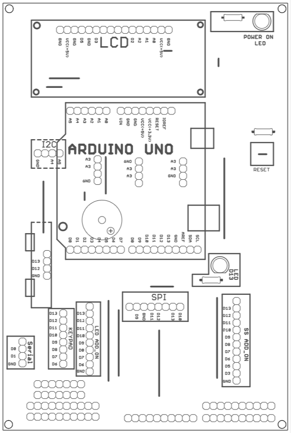

# Arduino Kit 
## This kit is based on Arduino Uno, for beginners, hobbyist
> Objective : 

The objective of this **Arduino Kit**, is to give basic understanding of microcontrollers, using world famous platform of Arduino IDE.

> About the Kit :  &nbsp;&nbsp;&nbsp;  [Example code](./examples)

 

Arduino kit will help the kids to understand and practice the making of connected world of Electronics / IoT. 

[Detailed Kit Layout](./images/kitlabeled.png)
[LED Add_on Board Layout](./images/LED_addon1.png)
[LED Add_on Board](./images/LED_addon2.png)

 